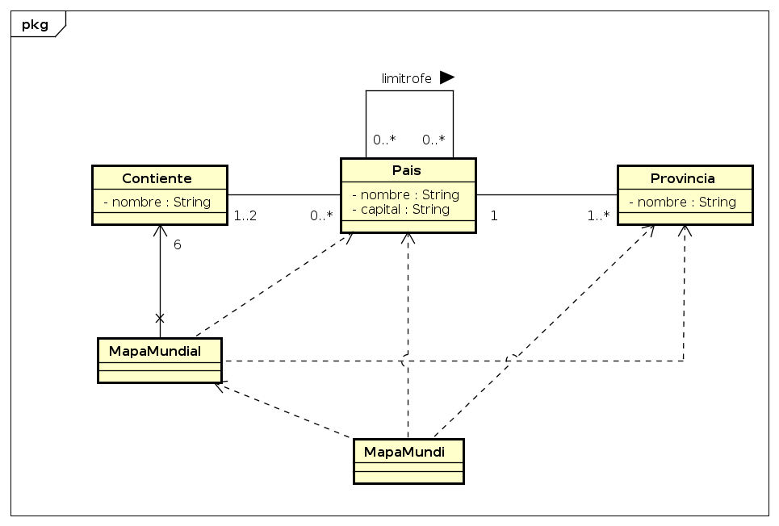

# TP4 - Mapa Mundial

## Estos fueron los objetivos que se cumplieron y los conocimientos que se aplicaron para realizar este ejercicio:

### 1. *Comprender las clases, objetos, métodos y variables de instancia.*
En la programación orientada a objetos, estos son conceptos fundamentales. Una clase es una plantilla para crear objetos, mientras que los objetos son instancias de una clase. Los métodos son funciones que se definen dentro de una clase y definen su comportamiento, mientras que las variables de instancia son variables que pertenecen a un objeto en particular.

### 2. *Declarar y utilizar una clase para crear un objeto.*
Este es el proceso de definir una clase y crear un objeto de esa clase. Primero, se define la estructura y el comportamiento de la clase y luego se crea un objeto de esa clase que tenga las características definidas en la clase.

### 3. *Declarar métodos en una clase para implementar su comportamiento.*
Los métodos son funciones que se definen dentro de una clase y definen su comportamiento. Al declarar métodos en una clase, se define cómo deben actuar los objetos creados a partir de esa clase y qué tareas pueden realizar.

### 4. *Declarar variables de instancia en una clase para implementar sus atributos.*
Las variables de instancia son variables que pertenecen a un objeto en particular. Al declarar variables de instancia en una clase, se definen los atributos que tendrán los objetos creados a partir de esa clase.

### 5. *Llamar a los métodos de un objeto para que realice sus tareas.*
Una vez que se ha creado un objeto a partir de una clase y se han definido los métodos para esa clase, se pueden llamar a los métodos del objeto para que realice sus tareas.

### 6. *Diferenciar entre variables de instancia de una clase y variables locales de un método.*
Las variables de instancia son variables que pertenecen a un objeto en particular, mientras que las variables locales son variables que solo existen dentro del método donde se han definido. Es importante diferenciar entre estos dos tipos de variables para evitar errores en el código.

### 7. *Utilizar un constructor para inicializar los datos de un objeto al crearlo.*
Un constructor es un método especial que se utiliza para inicializar los datos de un objeto cuando se crea. Al utilizar un constructor, se asegura que los datos de un objeto se inicialicen correctamente cuando se crea el objeto.

## Consignas 

1. **Cree una aplicación que represente el mapa del mundo, con las siguientes características:**
> - Un País tiene un nombre, una capital y pertenece a un continente.
> - Un País esta compuesto por provincias (en algunos países pueden ser estados y en otros departamentos pero tomaremos provincias para todos los casos).
> - Un Continente tiene un nombre y esta compuesto por Países.
> - Una Provincia tiene un nombre.

Estas clases deben tener operaciones para:

> - Crear e inicializar objetos. Método constructor y por ejemplo un continente crea sus países, un país sus provincias.
> - Devolver y actualizar los valores de sus atributos. Métodos get y set.
> - Devolver los Países de un Continente.
> - Devolver las Provincias de un País.
> - Sobrescribir el método toString de cada clase para mostrar como String a cada objeto.

Crear una clase MapaMundial, que:

> - Instancie e Inicialice los Continentes: América, Europa, Asia, África, Oceanía y Antártida.
> - Instancie e Inicialice los Países: Argentina, Uruguay, Brasil, Chile Paraguay, Bolivia, España, Francia, Italia y Portugal. Vincule cada País con su Continente.
> - Instancie e Inicialice las Provincias: Entre Ríos, Buenos Aires, Santa Fé, Corrientes, Córdoba, Salto, Paysandú, Canelones, Rocha y Maldonado. Vincule cada Provincia a su País.
> - Tenga un método getPaises que reciba como parámetro un String con el nombre del Continente y devuelva un Set de Países.
> - Tenga un método getProvincias que reciba como parámetro un String con el nombre de un País y devuelva un Set de Provincias.

**Crear una clase MapaMundi para interactuar con el usuario que tenga 2 opciones:**
> **a.** Permita ingresar el nombre de un Continente y liste en pantalla los Países de ese Continente. \
> **b.** Permita ingresar el nombre de un País y liste en pantalla las Provincias de ese País. \
> *Esta clase debe tener el método main para poder ejecutar la aplicación.*

Realice un diagrama de clases donde identifique las clases y las relaciones que hay entre los objetos
de estas clases.
Desarrolle en Java las clases identificadas con las operaciones solicitadas.

2. **Agregar al ejercicio anterior:** \
Un país tiene países limítrofes, por lo que un país debe tener una operación que devuelva cuales son
sus países limítrofes. \
La clase MapaMundial debe poder inicializar los países limítrofes. Use los países creados
anteriormente. Agregue un método gettLimitrofes que reciba un parámetro String con el nombre de
un País  y devuelva la lista de países limítrofes. \
En la clase MapaMundi, permitir ingresar el nombre de un país y listar en pantalla los países
limítrofes. 

## Diagrama de clases:

